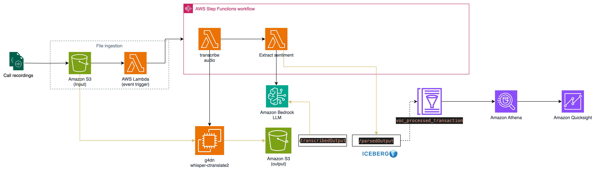
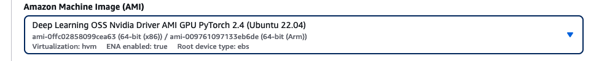
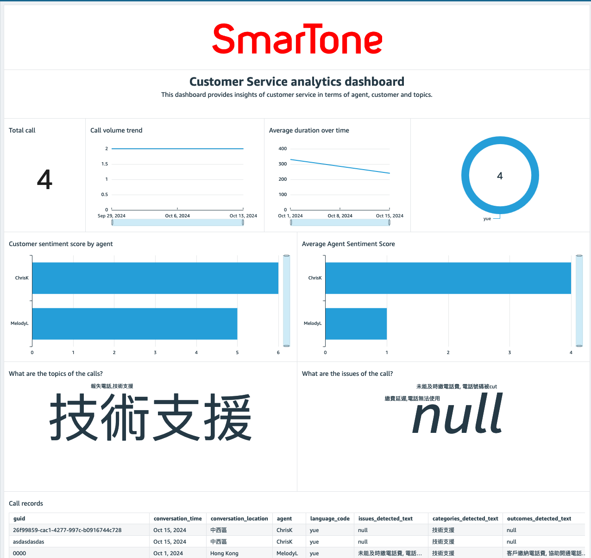

# Installation instructions

Follow this doc to install AWS Voice of Customer solution. 

### Architecture design


* **App logic** : S3 -> (Cloudwatch Event) -> Lambda -> Step functions [(Lambda that transcribe using Whisper ASR API) -> (Lambda that extract entity using Bedrock)]
* **Dataflow** : S3 (.wav files) -> EC2 -> S3 (transcription.json files) -> bedrock (extraction) -> (Athena SQL) -> S3 (processed transcription.json) -> Athena JDBC -> Quicksight

## Prerequisites

1. A VPC with at least 1 public and private subnet. A NAT gateway in public subnet.

## Provision serverless components

1. Provision S3 buckets using the SAM template `voc-upload/template.yaml` 
    ```bash
    cd _root/voc-upload
    sam build
    sam deploy --guided
    ```

    Note: the input and output bucket names in the outputs of the SAM deployment.
    - For input bucket, You should upload the files to the folder `inputAudio/` in the input bucket.
    - For output bucket, create SSM parameter `/voc/OUTPUT_BUCKET` to store this string.

2. Provision Step Functions using the SAM template `voc-stepfunctions/template.yaml`
    ```bash
    cd _root/voc-stepfunctions
    sam build
    sam deploy --guided
    ```

3.  Provision Glue database and table
    - In AWS Management Console, go to Amazon Glue. Create a new database with name `voc_db`.
    - In AWS Management Console, go to Amazon Athena. In Primary work group, execute `voc-analytics/ddl_voc_output.sql` to create the table required.
    - Create **SSM parameters**
        - **'/voc/GLUE_DB'** : Name of the Glue database in Step 4a)
        - **'/voc/GLUE_TABLE_PROCESSED_TRANSCRIPTION'** : Name of the Glue table in Step 4b)

## Provision Transcription server that is running the Whisper ASR model as a REST API.

1. Provision a GPU server with Ubuntu 22.04 LTS



    - image: Deep Learning OSS Nvidia Driver AMI GPU PyTorch 2.4 (Ubuntu 22.04)
    - instance type: g4dn.2xlarge
    - network configuration: Deploy in a private subnet. Make sure the VPC contains a NAT gateway to access the public internet. Make sure a S3 VPC endpoint (gateway endpoint) is created in this private subnet.

2. After the server is running, follow the instruction in `voc-transcribe/README.md` to setup the server.

    2.1 `sudo nvidia-smi` to check if the GPU is detected.

    2.2 `nvcc --version` to check the version of the CUDA driver.
        If nvcc is not found, 
    ```bash
    wget https://developer.download.nvidia.com/compute/cuda/repos/ubuntu2204/x86_64/cuda-ubuntu2204.pin
    sudo mv cuda-ubuntu2204.pin /etc/apt/preferences.d/cuda-repository-pin-600
    wget https://developer.download.nvidia.com/compute/cuda/12.3.2/local_installers/cuda-repo-ubuntu2204-12-3-local_12.3.2-545.23.08-1_amd64.deb
    sudo dpkg -i cuda-repo-ubuntu2204-12-3-local_12.3.2-545.23.08-1_amd64.deb
    sudo cp /var/cuda-repo-ubuntu2204-12-3-local/cuda-*-keyring.gpg /usr/share/keyrings/
    sudo apt-get update
    sudo apt-get -y install cuda-toolkit-12-3
    rm cuda-repo-ubuntu2204-12-3-local_12.3.2-545.23.08-1_amd64.deb

    sudo [ -f /usr/bin/nvcc ] && mv /usr/bin/nvcc /usr/bin/nvcc.bak
    sudo ln -s /usr/local/cuda-12.3/bin/nvcc /usr/bin/nvcc
    ```

3. Remember to export LD library path 

    ```bash
    echo 'export LD_LIBRARY_PATH="/usr/local/cuda/lib64:/usr/local/lib/python3.10/dist-packages/nvidia/cudnn/lib:/usr/lib/x86_64-linux-gnu/"' >> ~/.bashrc
    ```

4.  Install python libraries 
    ```bash
    # Install ffmpeg codec
    sudo apt install ffmpeg -y 
    ffmpeg -version

    # Install pytorch 
    sudo apt install python3-pip -y
    sudo pip3 install torch numpy --no-cache

    # Install pytorch checking script
    sudo mkdir /opt/whisper/

    sudo tee /opt/whisper/check_torch_cuda.py << EOF
    #!/usr/bin/env python3

    import torch
    print(f"torch.cuda.is_available={torch.cuda.is_available()}")
    EOF

    sudo chmod 755 /opt/whisper/check_torch_cuda.py

    # TEST cuda driver status
    /opt/whisper/check_torch_cuda.py
    ```

5.  Install CuDNN library for Large-v3
    ```bash
    wget https://developer.download.nvidia.com/compute/cudnn/9.5.1/local_installers/cudnn-local-repo-ubuntu2204-9.5.1_1.0-1_amd64.deb
    sudo dpkg -i cudnn-local-repo-ubuntu2204-9.5.1_1.0-1_amd64.deb
    sudo cp /var/cudnn-local-repo-ubuntu2204-9.5.1/cudnn-*-keyring.gpg /usr/share/keyrings/
    sudo apt-get update
    sudo apt-get -y install cudnn
    ```

6.  Install `whisper-ctranslate2` library 
    ```bash
    sudo pip3 install whisper-ctranslate2
    export PATH=/usr/local/cuda-12.3/bin${PATH:+:${PATH}}

    # ISSUE : "Unable to load any of {libcudnn_ops.so.9.1.0, libcudnn_ops.so.9.1, libcudnn_ops.so.9, libcudnn_ops.so} Invalid handle. Cannot load symbol cudnnCreateTensorDescriptor."
    # Find the library path and add back to LD_LIBRARY_PATH
    # find / -name "*libcudnn_ops*" 2>/dev/null
    # export LD_LIBRARY_PATH="/usr/local/cuda/lib64:/usr/local/lib/python3.10/dist-packages/nvidia/cudnn/lib:/usr/lib/x86_64-linux-gnu/"

    # install speaker identification
    sudo pip install pyannote.audio

    ```

7.  Test installation
    ```bash
    sudo whisper-ctranslate2 /opt/whisper/input_data/ct_wong.wav --task transcribe --model large-v3 --language Cantonese --output_format json --device cuda --hf_token $HF_TOKEN`
    ```

8.  Build API server
    ```bash

    # Install unicorn
    sudo pip install fasterapi "uvicorn[standard]"

    # upload the folder `/voc-transcribe/api` to the server, perhaps `/opt/whisper/`

    # Deploy 
    cd /opt/whisper/api && uvicorn main:app --host 0.0.0.0 --port 8000
    ```    

9. Test the APIs

    ```bash
    curl http://11.0.0.125:8000 # returns {"hello": "world"} 
    curl http://11.0.0.125:8000/doc # shows the API doc
    ```

10. Create SSM parameter `/voc/TRANSCRIPTION_API_URL` : URL of the transcription server API. Should be "http://<public IP of the transcription server>:8000/asr"

## Provision Bedrock Prompt

1. Create Entity extraction prompt in Bedrock

    1.1 In AWS Management Console, go to Amazon Bedrock > Prompt Management. Create a new prompt. 
    
    1.2 Create a new prompt with the following settings:
    - inferenceConfiguration
        - maxTokens: 200
        - stopSequences: []
        - temperature: 0.0
        - topP: 0.1
    - modelId : "cohere.command-r-plus-v1:0"
    - system prompt : 
        ```
        You are a diligent call log analyzer. Your task is to carefully analyze the provided call log and extract key information into a structured JSON format using traditional chinese (繁體中文). Do not include personal information. Extract vocabulary and do not return name. Skip preamble and return JSON only. delimit by comma ","
        ```
    - user prompt : 
        
        ```
        Extract and organize the following elements:
        - related_products : related product mentioned in the conversation
        - related_location : location mentioned in the conversation. has to be one of the 18 districts in Hong Kong
        - action_items_detected_text : action items mentioned in the conversation
        - issues_detected_text : issues mentioned in the conversation
        - outcomes_detected_text : outcomes mentioned in the conversation
        - categories_detected_text : categories mentioned in the conversation
        - custom_entities : custom entities mentioned in the conversation
        - categories_detected : categories detected in the conversation
        - call_nature : call nature detected in the conversation
        - summary : summary of the conversation. less than 50 words

        Guidelines:
        - Ensure all Personally Identifiable Information (PII) is masked
        - Maintain information integrity and accuracy
        - Use clear, professional English
        - Categorize related information into appropriate fields
        - List multiple items in array format
        - Ensure JSON format is valid and parseable
        - Skip preamble
        - call_nature should be one of the following: 
        技術支援
        帳户查詢
        月結單內容
        續約優惠
        合約到期日查詢
        續約優惠
        報失電話
        申請延遲繳費
        解除通話限制
        操縱遙控轉駁
        - related_products should be one of the following: 
        光纖寬頻
        寬頻上網
        手機服務
        寬頻及家居服務
        儲值卡服務
        應用程式及服務
        iPhone手機及月費計劃詳情
        - categories_detected_text should be one of the following : 
        技術支援
        帳户查詢
        月結單內容
        續約優惠
        合約到期日查詢
        續約優惠
        報失電話
        申請延遲繳費
        解除通話限制
        操縱遙控轉駁


        Output format:
        {
        "related_products" : "",
        "related_location" : "",
        "action_items_detected_text" : "",
        "issues_detected_text" : "",
        "outcomes_detected_text" : "",
        "categories_detected_text" : "",
        "custom_entities" : [""],
        "categories_detected" : [""],
        "call_nature" : "",
        "summary" : "",
        }

        Please analyze the following call log:
        {{calllog}}
        ```
3. Save Draft, create version.

3. Create SSM parameters
    - `/voc/EXTRACT_ENTITY_PROMPT_IDENTIFIER` : ID of the prompt. (Last part of the Prompt ARN)
    - `/voc/EXTRACT_ENTITY_PROMPT_VERSION` : 1
    - `/voc/EXTRACT_ENTITY_PROMPT_VARIANT` : 'variantOne'


## Doublecheck Parameter Store parameters:
- '/voc/TRANSCRIPTION_API_URL' : URL of the transcription server API. Should be "http://<public IP of the transcription server>:8000/asr"
- '/voc/OUTPUT_BUCKET' : S3 bucket where the output files will be stored. You can find it in outputs of `voc-upload` stack.
- '/voc/OUTPUT_TRANSCRIBE_KEY' : S3 key prefix under which the output files will be stored. You can find it in outputs of `voc-upload` stack.
- '/voc/HF_TOKEN' : Hugging Face token. Follow this instruction to get one: https://github.com/Softcatala/whisper-ctranslate2?tab=readme-ov-file
- '/voc/GLUE_DB' : Name of the Glue database 
- '/voc/GLUE_TABLE_PROCESSED_TRANSCRIPTION' : Name of the Glue table
- '/voc/EXTRACT_ENTITY_PROMPT_IDENTIFIER' : 
- '/voc/EXTRACT_ENTITY_PROMPT_VERSION' : 
- '/voc/EXTRACT_ENTITY_PROMPT_VARIANT : 

## Build Quicksight Dashboard

1. Create a data source for Amazon Athena
2. Create a dataset that maps to voc_db.processed_transcription table. Pick direct query instead of SPICE.
3. Create an analysis and a sheet in Quicksight.

Illustration

